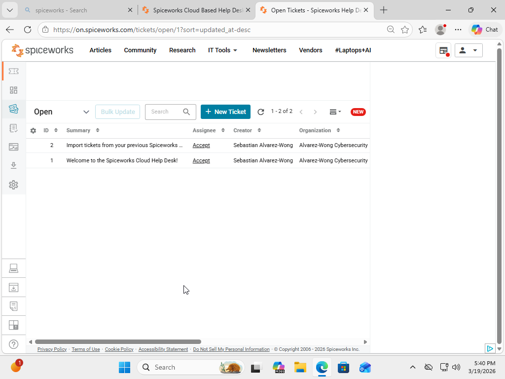
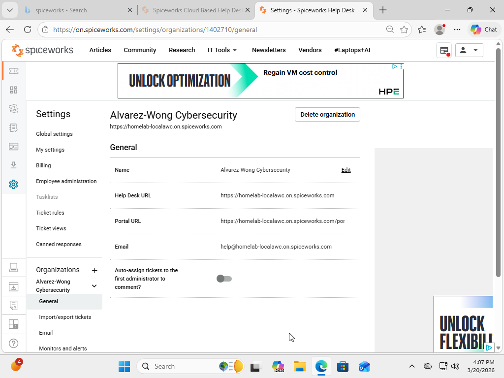
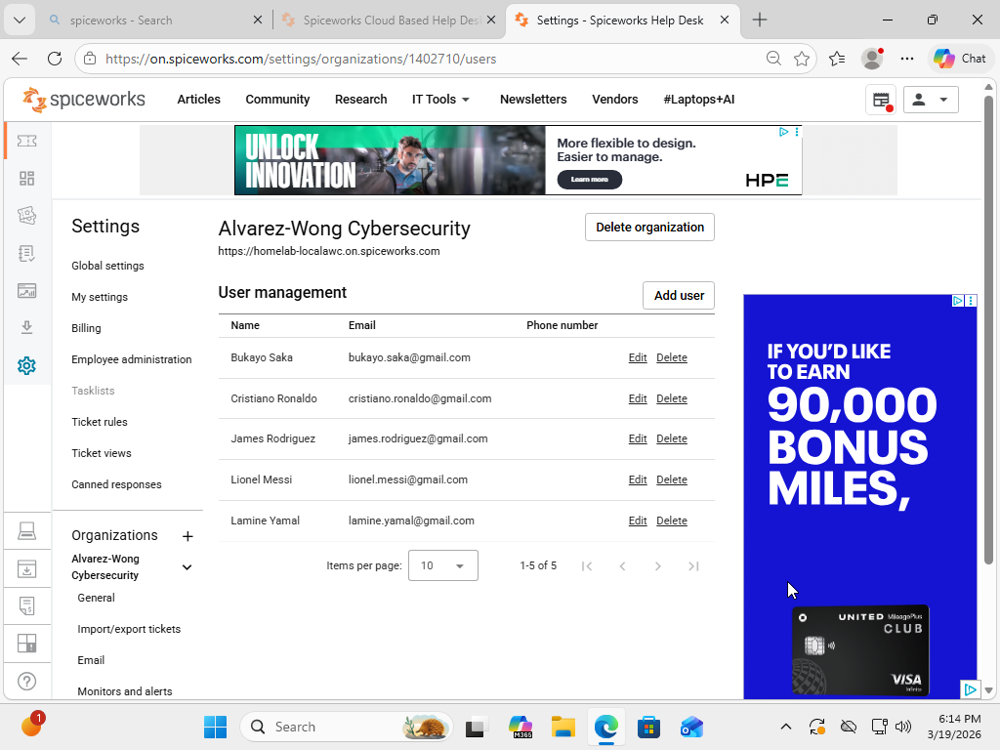
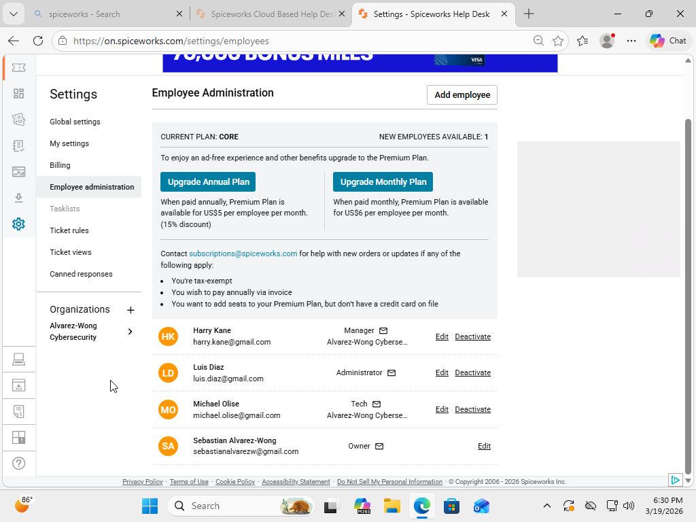
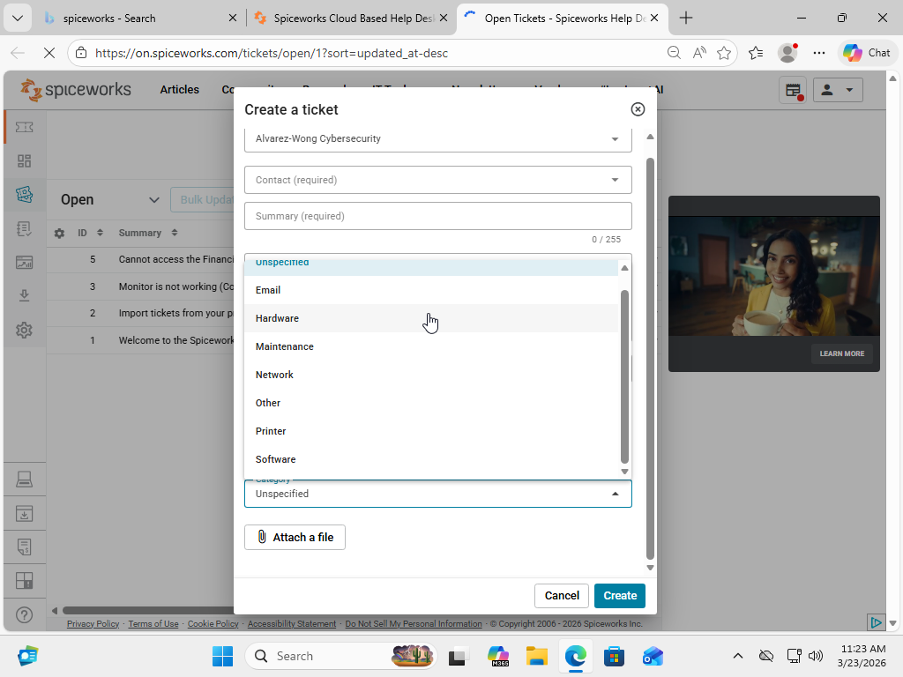
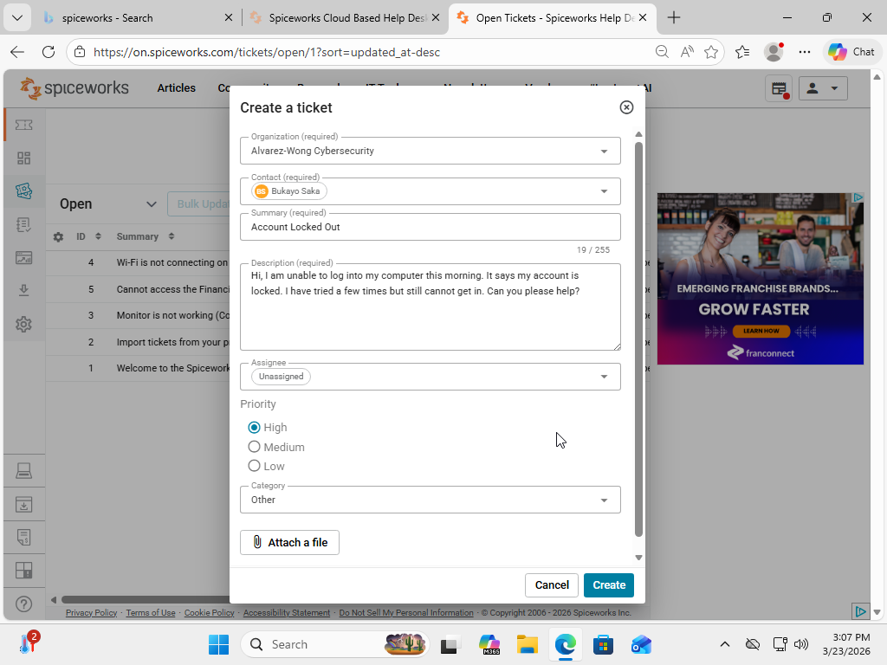
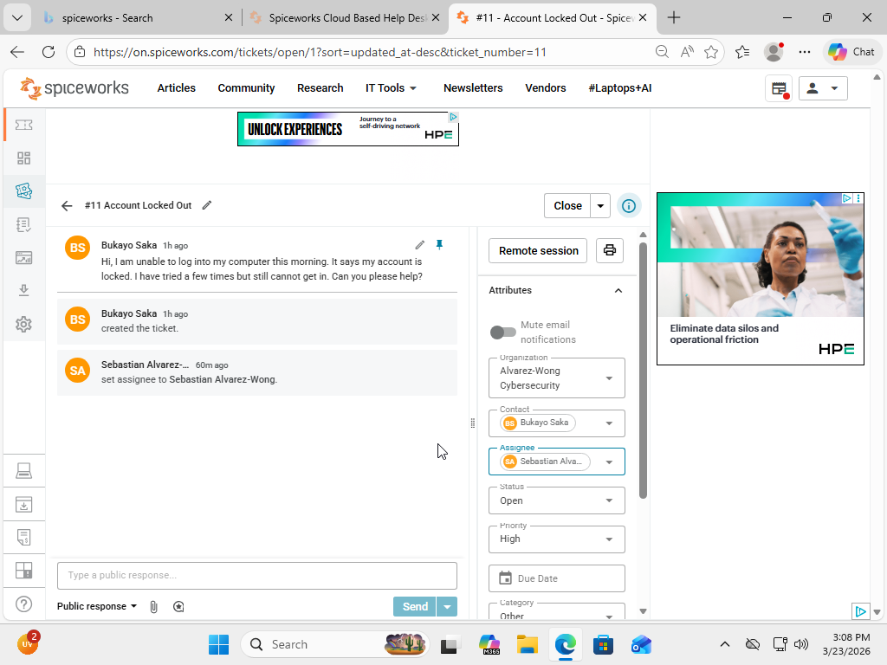
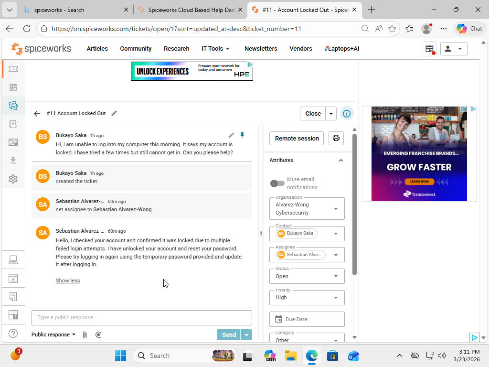
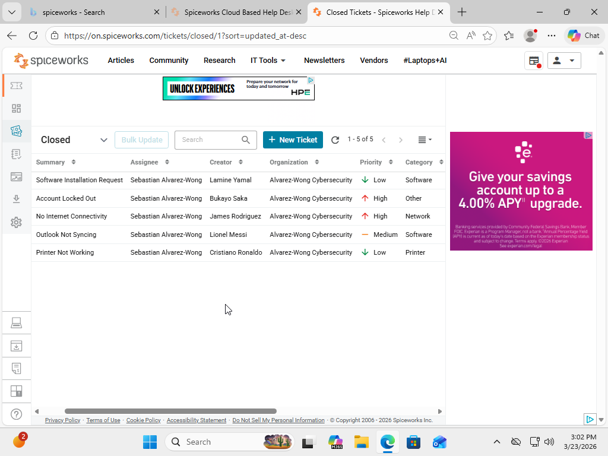

# Spiceworks Help Desk Ticketing System Lab

## Project Overview

This project involved implementing a cloud-based help desk ticketing system using Spiceworks to simulate a real-world Tier 1 IT support environment.

The lab demonstrates core help desk operations including ticket creation, user management, ticket categorization and prioritization, incident troubleshooting, documentation, and ticket lifecycle management.

## Objectives

- Simulate Tier 1 IT support incidents
- Configure a cloud-based help desk environment
- Create and manage end users and IT support agents
- Categorize and prioritize support requests
- Manage tickets from creation through resolution
- Apply structured troubleshooting methodologies
- Document incidents and resolutions using ITSM practices

## Lab Environment

### Host System
- Windows 11
- Internet-connected workstation

### Platform
- Spiceworks Cloud Help Desk

## Technologies Used

- Spiceworks Cloud Help Desk
- Windows 11
- Web-based ITSM tools
- Windows troubleshooting tools

## Implementation

### 1. Create Spiceworks Help Desk Environment

A Spiceworks Cloud Help Desk instance was created by registering an account and initializing an organization. This provided a centralized platform for managing IT support tickets and simulating a real-world help desk environment.

Figure 1 – Spiceworks Help Desk dashboard displaying the main interface used to manage support tickets and system configurations.

### 2. Configure Organizational Settings

Organizational settings were configured including company name and domain to establish the structure of the help desk environment. This ensures proper identification of users and ticket ownership.

Figure 2 – Organizational settings panel showing configured company information used to structure the help desk environment.

### 3. Create End Users

End users were created within the system to simulate employees submitting support requests. These users represent different departments within a business environment.

Figure 3 – User management interface displaying multiple end users created to simulate employees submitting support tickets.

### 4. Create IT Support Agents

An IT support agent account was created and assigned administrative privileges. This agent is responsible for managing, troubleshooting, and resolving support tickets within the system.

Figure 4 – Employee administration panel showing the creation of an IT support agent with administrative access to manage tickets.

### 5. Utilize Ticket Categories

Predefined ticket categories within Spiceworks were utilized to classify support requests. These categories enabled proper organization, prioritization, and tracking of incidents within the help desk system. 

Figure 5 – Ticket creation interface displaying predefined categories used to classify and organize support requests within the help desk system.

### 6. Create Support Tickets

Support tickets were created to simulate real-world IT incidents. Each ticket includes user details, issue descriptions, priority levels, and assigned technicians.

Figure 6 – Ticket creation interface displaying a newly submitted support request including issue details and assigned user

### 7. Assign and Manage Tickets

Tickets were assigned to the IT support agent and updated throughout the troubleshooting process. Status changes were applied to reflect progress and resolution.

Figure 7 – Ticket management interface showing an assigned ticket with updated status and technician ownership.

### 8. Perform Troubleshooting

Troubleshooting steps were performed based on the issue type. Common diagnostic tools and techniques were used to identify and resolve problems.

Figure 8 – Ticket activity log displaying troubleshooting steps and diagnostic actions performed to resolve the issue.

### 9. Resolve and Close Tickets

Tickets were resolved after identifying and fixing the issue. Final documentation was added before closing the ticket to maintain a complete support record.

Figure 9 – Completed ticket showing final status marked as closed after successful issue resolution.

## Results

Successfully implemented a functional help desk environment that simulated common Tier 1 IT support operations.

The lab demonstrated the complete ticket lifecycle from initial user request through categorization, prioritization, assignment, troubleshooting, documentation, resolution, and closure.

## Troubleshooting & Lessons Learned

Working through simulated support incidents reinforced the importance of following a structured troubleshooting process rather than immediately assuming the cause of an issue.

The lab also demonstrated the importance of maintaining clear ticket documentation. Recording troubleshooting steps, communication, status changes, and final resolutions creates a complete support history that can assist other technicians and improve future incident resolution.

### Key Takeaways

- Ticket priority should reflect the impact and urgency of an issue.
- Clear documentation helps technicians understand what troubleshooting has already been performed.
- Ticket categories make incidents easier to organize and track.
- Status and ownership should be kept current throughout the ticket lifecycle.
- Final resolutions should be documented before closing tickets.

## Skills Demonstrated

- IT Help Desk Operations
- Ticketing System Management
- Incident Management
- Ticket Prioritization
- Troubleshooting Methodology
- ITSM Workflows
- Customer Support Communication
- Technical Documentation
- Ticket Lifecycle Management
